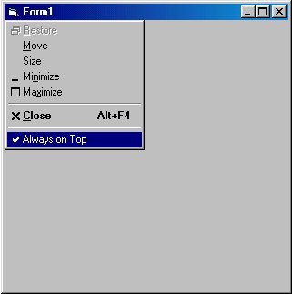

<div align="center">

## Extending System Menu


</div>

### Description

This code example will append a separator and a new MenuItem 'Always on Top' to the system menu of any form.

The menu is affected weather left clicked from the control box on the form or right clicked from the taskbar.

Subclassing is used to trap when the 'Always on Top' item is clicked.

The custom message handler uses the SetWindowPos function to keep window on top or reset it to normal.

Also on a lark I traped out the close menu item to prompt before closing. If you say yes then the close message it passed otherwise the close message is traped out and the form stays open.
 
### More Info
 
'Be careful and save work often. Subclassing can cause your system to GPF.


<span>             |<span>
---                |---
**Submitted On**   |
**By**             |[Karl  P\. Grear](https://github.com/Planet-Source-Code/PSCIndex/blob/master/ByAuthor/karl-p-grear.md)
**Level**          |Advanced
**User Rating**    |4.9 (44 globes from 9 users)
**Compatibility**  |VB 5\.0, VB 6\.0
**Category**       |[Custom Controls/ Forms/  Menus](https://github.com/Planet-Source-Code/PSCIndex/blob/master/ByCategory/custom-controls-forms-menus__1-4.md)
**World**          |[Visual Basic](https://github.com/Planet-Source-Code/PSCIndex/blob/master/ByWorld/visual-basic.md)
**Archive File**   |[](https://github.com/Planet-Source-Code/karl-p-grear-extending-system-menu__1-6724/archive/master.zip)

### API Declarations

```
'**** MODULE LEVEL Declarations ****
Option Explicit
Dim MenuItemID As Long
Dim MenuHandle As Long
Dim MenuCloseID As Long
Dim Checked As Boolean
Public OldProc As Long
Declare Function SetWindowLong Lib "user32" Alias "SetWindowLongA" (ByVal Hwnd As Long, ByVal nIndex As Long, ByVal dwNewLong As Long) As Long
Declare Function GetWindowLong Lib "user32" Alias "GetWindowLongA" (ByVal Hwnd As Long, ByVal nIndex As Long) As Long
Public Const GWL_WNDPROC = (-4)
Declare Function CallWindowProc Lib "user32" Alias "CallWindowProcA" (ByVal lpPrevWndFunc As Long, ByVal Hwnd As Long, ByVal Msg As Long, ByVal wParam As Long, ByVal lParam As Long) As Long
'The window message to monitor
Const WM_SYSCOMMAND = &H112
'menu API's
Declare Function GetSubMenu Lib "user32" (ByVal hMenu As Long, ByVal nPos As Long) As Long
Declare Function GetMenuItemID Lib "user32" (ByVal hMenu As Long, ByVal nPos As Long) As Long
Declare Function GetSystemMenu Lib "user32" (ByVal Hwnd As Long, ByVal bRevert As Long) As Long
Declare Function AppendMenu Lib "user32" Alias "AppendMenuA" (ByVal hMenu As Long, ByVal wFlags As Long, ByVal wIDNewItem As Long, ByVal lpNewItem As Any) As Long
Declare Function DrawMenuBar Lib "user32" (ByVal Hwnd As Long) As Long
Declare Function CheckMenuItem Lib "user32" (ByVal hMenu As Long, ByVal wIDCheckItem As Long, ByVal wCheck As Long) As Long
Public Const MF_SEPARATOR = &H800&
Public Const MF_CHECKED = &H8&
Public Const MF_UNCHECKED = &H0&
'Window Positioning API
Declare Function SetWindowPos Lib "user32.dll" (ByVal Hwnd As Long, ByVal hWndInsertAfter As Long, ByVal x As Long, ByVal y As Long, ByVal cx As Long, ByVal cy As Long, ByVal wFlags As Long) As Long
Const SWP_NOMOVE = &H2
Const SWP_NOSIZE = &H1
'Used to set window to always be on top or not
Const HWND_NOTOPMOST = -2
Const HWND_TOPMOST = -1
```


### Source Code

```
'**** MODULE LEVEL CODE ****
Public Function WndProc(ByVal Hwnd As Long, ByVal wMsg As Long, ByVal wParam As Long, ByVal lParam As Long) As Long
Dim retval As Long
'Is triggered if Always on top is clicked.
If wMsg = WM_SYSCOMMAND And wParam = MenuItemID Then
 WndProc = 0
 If Checked Then
 'switch menu to unchecked
 retval = CheckMenuItem(MenuHandle, MenuItemID, MF_UNCHECKED)
 'set window to not top most window
 retval = SetWindowPos(Hwnd, HWND_NOTOPMOST, 0, 0, 1, 1, SWP_NOMOVE Or SWP_NOSIZE)
 'toggle checked
 Checked = Not Checked
 Else
 'switch menu to checked
 retval = CheckMenuItem(MenuHandle, MenuItemID, MF_CHECKED)
 'make window always on top
 retval = SetWindowPos(Hwnd, HWND_TOPMOST, 0, 0, 1, 1, SWP_NOMOVE Or SWP_NOSIZE)
 'toggle checked
 Checked = Not Checked
 End If
 Exit Function
End If
'Is Triggered if Close is clicked.
If wMsg = WM_SYSCOMMAND And wParam = MenuCloseID Then
 retval = MsgBox("Are you sure you wish to exit?", vbYesNo, "Confirm Close")
 If retval = vbNo Then
 'Traps out the Close event so window does not close.
 WndProc = 0
 Exit Function
 End If
End If
'Pass on all the other unhandled messages
WndProc = CallWindowProc(OldProc, Hwnd, wMsg, wParam, lParam)
End Function
Public Sub AddMenuItem(Hwnd As Long)
Dim x As Long
Checked = False
'Get system menu handle
MenuHandle = GetSystemMenu(Hwnd, False)
'Append a seporator line
x = AppendMenu(MenuHandle, MF_SEPARATOR, 0, "")
'Append Always on Top Item, and Set to unchecked - 555 is the ItemID.
x = AppendMenu(MenuHandle, MF_UNCHECKED, 555, "Always on Top")
'Redraw the menubar
x = DrawMenuBar(Hwnd)
'Get menuitemid for item 8 and 6 in system menu which are 'Always on Top' and 'Close'.
MenuItemID = GetMenuItemID(MenuHandle, 8)
MenuCloseID = GetMenuItemID(MenuHandle, 6)
'store the old message handler.
OldProc = GetWindowLong(Hwnd, GWL_WNDPROC)
'set the message handler to ours.
SetWindowLong Hwnd, GWL_WNDPROC, AddressOf WndProc
End Sub
Sub UnHookWindow(Hwnd As Long)
'Sets procedure for handling events back to the original.
 SetWindowLong Hwnd, GWL_WNDPROC, OldProc
End Sub
'**** FORM LEVEL CODE ****
'Paste this code in any form.
Option Explicit
Private Sub Form_Load()
 'Setup menus and message handlers.
 Call AddMenuItem(Me.Hwnd)
End Sub
Private Sub Form_Unload(Cancel As Integer)
 'Restore message handler. Run this or crash.
 Call UnHookWindow(Me.Hwnd)
End Sub
```

